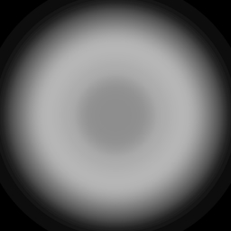

# IES Importer for Unity

This package provides an importer in the Unity Editor for IES light files. It reads the data from IES files in the project and generates a light cookie texture that can be used with either spot lights or point lights.

At this stage is it still experimental and very WIP: only spot cookie generation works, and it has some artifacts that need to be resolved.

## License

This project is available under the MIT license. See the LICENSE file for details.